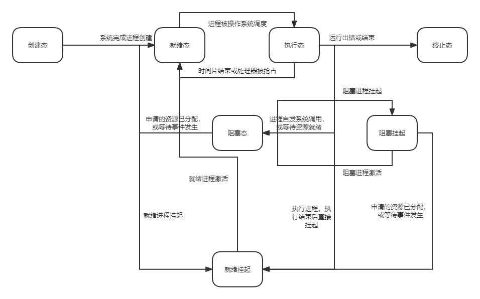

# 操作系统

## 一、操作系统基础知识

### 1.1 操作系统的概念

操作系统（Operating System，OS）是协调硬件资源和软件的一个接口层次。

- 负责管理协调硬件、软件等计算机资源的工作
- 为上层的应用程序、用户提供简单易用的服务（主要指接口和环境）
- 操作系统是系统软件，可以直接控制硬件资源而非硬件

### 1.2 操作系统的功能与目标

（1）实现资源的管理

- 处理机管理（cpu的分配）
- 存储器管理（整个存储层次结构与虚存）
- 文件管理（文件系统）
- 设备管理（IO设备）

（2）为用户提供方便的接口服务

包括命令接口，程序接口与GUI用户界面操作。

命令接口包括脱机命令接口与联机命令接口。联机命令接口，即交互式命令接口，输入一条命令执行一条命令（如在`Terminal`等终端输入指令）；脱机命令接口即顺序执行，编写好一系列指令后由操作系统直接执行涉及的所有指令（如`Windows`中的`.bat`格式文件）。

程序接口即具有特定功能的可执行程序，是一组系统调用（如Windows中的`.dll`文件）

（3）对硬件裸机进行功能扩展，扩充机器的功能。

### 1.3 操作系统的四大特征

操作系统的四大特征为：并发、共享、虚拟、异步；并发和共享为两大最基本特征，并二者互为存在条件。

（1）并发

并发是指在同一个时间间隔内，两个或多个事件同时“发生”。这里的发生是指宏观上同时，而微观上交替（可能是以时间片为单位交替）。与之区分的并行：并行是指两个或多个事件，真正意义上的同时发生（例如体系结构优化的指令级、数据级与线程级并行，并行的发生需要多套设备支持）

对于操作系统来说，并发性是指操作系统中同时运行着多个执行程序。**操作系统和程序并发是同时产生的。**

（2）共享

共享是指系统中的资源可供内存中多个**并发**执行的进程共同使用。

- 互斥共享方式：虽然允许多个进程共同使用，但一个时间段内只允许一个进程访问（宏观上不能同时）；
- 同时共享方式：允许一个时间段内多个进程“同时”访问资源（宏观上同时，微观上可能交替）；

（3）虚拟

虚拟是指把一个物理上的实体映射为多个逻辑上的对应物。物理上的实体是真实存在的，而逻辑上是在用户的角度上看的结果。

例如：

- 虚拟内存，物理上的实体是内存，逻辑上的对应物是包括外存在内大小的可用存储。（空分复用技术）
- 虚拟处理器，物理上的单核处理器，在时间上交替可以看作逻辑上的多个处理器线程。（时分复用技术）

（4）异步

异步是指多道程序环境下，允许多个程序**并发**执行，但由于资源有限，进程的执行不是一步到底的，而是走走停停。

### 1.4 操作系统的分类

操作系统按发展顺序，分为以下几种类别：手工操作阶段，批处理阶段，分时操作系统，实时操作系统，网络操作系统，分布式操作系统，个人计算机操作系统。

（1）手工操作阶段

计算机最开始发明的阶段，此阶段是没有操作系统的，程序通过纸带打孔来书写。需要通过纸带机读取和书写纸带的内容。

缺点：用户独占全机，人机速度矛盾导致的资源利用率极低

（2）批处理操作阶段

- 单道批处理系统：引入了**脱机输入/输出技术**（通过磁带），并通过**监督程序（监督程序负责控制某条程序的执行）**控制作业的输入输出（操作系统雏形）

    优点：缓解了人机速度矛盾，一定程度提高了资源利用率

    缺点：内存中只能有一道程序运行（即不支持并发），程序结束之后才能调入下一道程序（程序的输入/输出过程会耗费大量时间），cpu很长时间内是在等待I/O设备就绪。

- 多道批处理系统：在单道批处理系统的基础上改进，计算机会一次调入多道程序进入内存，**多道程序并发执行**（并发执行需要中断机制，同时使用了流水线技术），**操作系统正式诞生，此时的操作系统拥有并发性和共享性**。

    优点：多程序并发执行，吞吐量增大，资源利用率大幅提升

    缺点：用户响应时间长（需要等待多道程序执行完成后才有相应），没有人机交互功能（不能在执行过程中进行控制）。

（3）分时操作系统

计算机会以时间片的形式**轮流为每个用户/作业**提供服务，各个用户可通过终端与计算机进行交互。

优点：解决了多道批处理系统无法交互与响应时间长的问题

缺点：无法对作业进行时间调度，不能优先处理一些紧急任务。

（4）实时操作系统

对于一些紧急的任务会优先分配时间片进行响应，主要特点是**及时性和可靠性**。

- 硬实时操作系统：每个任务必须在严格的规定时间内完成处理（如导弹系统）
- 软实时操作系统：能接受偶尔违反时间规定（如12306）

（5）网络操作系统

伴随着计算机网络诞生，能将网络中各个计算机连接起来，实现数据传送等功能。实现了网络中各种资源的共享与计算机间的通信。

（6）分布式操作系统

主要特点是分布性和并行性，控制一个计算机集群，任何工作都可以**分布**在这些计算机上，由他们并行、协同完成任务处理。

（7）个人计算机操作系统

方便个人使用。

### 1.5 操作系统的运行机制与体系结构

（1）操作系统的运行机制

cpu处理的指令分为特权指令和非特权指令：

- 非特权指令：如加减等运算指令
- 特权指令：如内存清零指令，不能让普通用户使用。

cpu通过处理器状态（状态寄存器记录）确定当前是否允许执行特权指令：

- 用户态（目态）：只能执行非特权指令
- 核心态（管态）：可以执行所有指令（陷入指令除外）

操作系统根据能否执行特权指令，把程序分为两种：

- 应用程序：运行在目态，只能运行非特权指令。
- 内核程序：运行在管态，是系统资源的管理者，既可以执行特权指令，也可以执行非特权指令。

（2）操作系统的内核

操作系统大致分为两个层次：内核与非内核。

**内核层** 是操作系统中最核心最基本的部分，是计算机上配置的底层软件：

- 最核心功能（离硬件最近）：时钟管理、中断处理、原语（设备驱动、cpu切换等）……

> 时钟管理：实现处理器的计时功能，所有的设备运行都需要依赖同步时钟。
>
> 原语：原语是一种特殊的程序，最接近硬件的部分，这种程序的运行具有原子性。

- 其他功能（对一些系统资源进行管理）：进程管理，存储器管理，设备管理等。

**非内核层** 则是在内核的基础上衍生出来的一些功能性较强较方便的内容

如Linux的内核大小为几十兆，而完整版要几百兆，在docker的镜像中可以通过完善Linux内核实现不同版本的Linux环境（如添加一个vim工具等等）

（3）操作系统体系结构

操作系统的体系结构一般分为：大内核和微内核。

- 大内核：把上述内核层的所有部分全部纳入内核

    优点：高性能

    缺点：内核代码庞大，结构混乱难以维护

- 微内核：只包含最核心功能（不包括对一些系统资源的管理）

    优点：内核功能较少，组织结构清晰，方便维护

    缺点：需要频繁地在管态和目态间切换（因为管态只负责最核心的功能，其他对系统资源的管理程序运行在目态），性能低

### 1.6 中断机制

中断的诞生是为了解决同一个时间段内只能有一道程序执行的问题（各程序只能整体上串行）。发生中断就意味着需要**操作系统介入进行管理工作**。

（1）中断机制概念和作用

广义的中断是指在进程执行过程中，通过中断信号是处理器切换为管态，并执行中断处理程序。

中断发生时，cpu会切换为核心态（即管态）进行中断处理（会暂停并保存原程序，中断处理完成后返回）。有了中断才能实现多个程序的并发执行。目态到管态的切换是由中断完成的，并且**中断是唯一的切换方式**，不存在通过直接操作状态寄存器来实现状态切换的情况。

> 一个基本的并发执行会以时间片为单位，每个时间片结束会通过时钟中断使操作系统接管控制权，通过一系列特权指令控制切换为另一个进程执行。

（2）中断分类

广义上的中断根据中断信号的来源分为内中断和外中断：

- 内中断：又称异常（exception）或陷入（trap），中断信号来自处理器内部，是当前执行指令导致的中断；
- 外中断：简称为中断（狭义的中断），中断信号来自处理器外部，与当前执行的执行无关； 

一般在内外中断同时发生时，内中断优先级高于外中断；外中断信号会被保存。

（3）外中断处理过程

处理器在目态下执行程序指令时，每条指令完成后会检查是否有外部中断信号，如果存在则会进行中断处理：

- 保存处理器现场（如状态寄存器、指令pc、处理器权限等）
- 切换为管态
- 切换为中断处理程序（属于操作系统内核，运行在管态）
- 执行完处理程序后，切换回原进程

### 1.7 系统调用

系统调用操作系统提供给应用程序使用的接口，可以理解为一种可供应用程序调用的特殊函数，应用程序可发起系统调用请求来获取操作系统的服务。

在没有系统调用的情况下，应用程序使用操作系统功能时会出现共享资源冲突的问题，为解决该问题引入系统调用。任何进程想要使用共享资源时，都需要向操作系统发起系统调用，操作系统会对所有的调用请求进行协调管理，从而保证系统的**安全性和稳定性**。

即**为功能的实现增加一层受控的接口，并且功能只能由该接口提供，限制了一些非法情况的出现**。

系统调用的一般分类：

- 设备管理：完成设备的 请求 / 释放 / 启动 等功能
- 文件管理：完成文件的 读 / 写 / 创建 / 删除 等功能
- 进程控制：完成进程的 创建 / 撤销 / 阻塞 / 唤醒 等功能
- 进程通信：完成进程间的 消息传递 / 信号传递 等功能
- 内存管理：完成内存的 分配 / 回收 等功能

系统调用设计到的相关处理总是会使用一些特权资源，因此**系统调用后的处理必须要在管态下执行**。

##  二、进程

### 2.1 进程基础知识

（1）进程的概念

在由单道批处理系统向多道批处理系统转化时，需要在内存中的不同位置保存不同进程的程序段和数据段，因此引入进程的概念。操作系统在每个程序开始执行时，会为该程序创建一个进程控制块（Processing Control Block， PCB），其中包含操作系统对该进程进行管理需要的基本信息。

**程序段、数据段、PCB三部分组成了进程实体（也叫进程映像）**。一般来说，将进程实体简称为进程，创建进程就是创建PCB，撤销进程就是撤销PCB。**PCB是进程存在的唯一标识**。

进程是进程实体的运行过程，是系统进行资源分配和调度的独立单位。进程是**动态**的，而进程实体是静态的。

> PCB中包含的信息：
>
> - 进程描述信息：包括进程标识符`PID`（进程的唯一标识），用户标识符`UID`
> - 进程控制和管理信息：包括进程的状态、进程的优先级
> - 资源分配清单：程序段指针，数据段指针，键盘、鼠标
> - 处理机相关信息：各种寄存器的值，一般用来进程切换时保护现场

（2）进程的组织方式

一个系统上会同时运行多个进程，这些进程的信息需要操作系统统一协调维护。操作系统组织进程的方式主要分为两种：

- 链接方式
- 索引方式

链接方式是按状态将PCB分为多个队列，操作系统持有多个队列的指针；

索引方式是按状态创建多个索引表，索引表中的表项是每个该状态PCB的指针，操作系统持有索引表的指针。

（3）进程的特征

进程和程序有非常大的区别，进程具有以下特征：

- 动态性：进程是程序的一个动态执行过程，是动态产生、变化和消亡的
- 并发性：系统中有多个进程实体并发执行
- 独立性：进程是能独立运行，独立获得资源，独立进行调度的基本单位
- 异步性：各进程独立地，按不可知的速度执行，操作系统需要通过同步机制解决异步问题
- 结构性：每个进程会配置一个PCB，进程的组成结构基本一致

### 2.2 进程状态与转化

（1）进程的状态

进程具有三种基本状态：运行态（Running）、就绪态（Ready）与阻塞态（Waiting）

- 运行态：进程占有CPU并在其上运行；若是单核CPU，每个时刻最多有一个进程处于运行态。
- 就绪态：进程已经具备了运行条件，但由于无CPU空闲无法执行；即已经拥有了除处理器外的所有资源，只需要等待处理器空闲（待调度）
- 阻塞态：因某一事件暂时无法运行（如等待设备完成）。

另外两种状态：创建态与销毁态，分别执行进程创建的前置工作与撤销进程时回收工作。

（2）进程的状态转化

进程的状态机图如下：

### 2.3 进程控制

（1）基本概念

进程的控制其实就是控制进程状态的转变。包括创建态 -> 就绪态、就绪态 -> 执行态、执行态 -> 就绪态、执行态 -> 阻塞态、阻塞态 -> 就绪态 以及 执行态 -> 终止态。

- 创建进程：初始化PCB，分配系统资源
- 创建态 -> 就绪态：修改PCB，并调整组织队列（或索引表）
- 就绪态 -> 执行态：修改PCB，调整组织队列，同时还应该恢复执行现场
- 执行态 -> 就绪态（进程切换）：保存运行环境，修改PCB及队列
- 执行态 -> 阻塞态：保存运行环境，修改PCB及队列
- 阻塞态 -> 就绪态：恢复环境，修改PCB及队列；若阻塞是由于资源请求还需要分配资源
- 执行态 -> 终止态：回收进程资源、撤销PCB

由于修改PCB与调整进程组织队列二者应该是一个原子化的操作，因此为避免进程状态与所处队列不符合的情况，进程的控制采用原语来实现（在原语执行代码前后分别进行**关中断和开中断**，即控制全局中断使能）。

（2）进程控制相关原语

通过原语进行进程控制时，无论是什么情况都要做三个方面的处理：

1. 更新PCB中的信息，包括状态修改，保存运行环境同时恢复运行环境；
2. 将PCB修改到合适的队列
3. 分配 / 回收资源

涉及到的原语有：进程的创建、终止、阻塞、唤醒、切换

### 2.4 进程间通信

系统上运行的进程都有自己独立的一块空间，不同进程间不能相互访问。在此基础上的进程间通信有三种方式：共享存储、消息传递与管道通信。（管道通信与消息传递类比理解Spring整合的消息队列MQ）

（1）共享存储

共享存储是操作系统为通信的进程创立一块共享的内存空间，进行通信的进程都由对该空间的访问权限，因此成为共享。但不同进程访问该存储应该时互斥的，即虽然多个进程都具有访问权限，但不能同时访问。互斥通过操作系统的互斥工具实现（如P，V操作）。

共享存储分为：**基于数据结构的共享与基于存储区的共享**。

基于数据结构的共享，是共享空间里只能存放规定格式的数据，效率低，但存在限制较安全。

基于存储区的共享，是共享空间的数据形式和存放位置，都由进程自由控制，相比之下通信更快，是一种高级的通信方式。

（2）消息传递

消息传递是指进程间的通信通过**格式化**的消息中间件（message）为单位实现。消息中间件包括**消息头和消息体**，前者是消息的收发进程信息，后者是通信的数据。（参考微服务消息队列`RabbitMQ`）

- 直接通信方式：发送进程创建好消息格式后，直接挂到接受进程的消息缓冲队列中（缓冲队列的缓冲作用可以实现异步通信，减少阻塞）。
- 间接通信方式：消息要先发送到消息中间实体，再分发到各个接受进程。

（3）管道通信

管道通信是指，操作系统为需要通信的进程开辟一块大小固定的**缓冲区**作为管道（可以是连接读写进程的一个共享文件）。

管道通信采用半双工通信，某一时间段内只能单向传输；若要双向则需要设置两个管道。同时进程对管道的访问应该是互斥的，只有在一个进程释放管道后其他进程才可以访问。

当管道为空时，读进程的读操作被阻塞；当管道满时，写进程的写操作被阻塞。若没有写满则不允许读，若没有读空则不允许写。

管道中的数据，读出一次后会被管道丢弃，其他进程无法再读出。因此**管道的读进程只能有一个**。

### 2.5 线程与多线程模型

（1）线程的概念与作用

进程是一串顺序执行的指令段，进程只能串行地执行，是程序流执行的最小单位。但部分进程需要同时处理不同任务（如QQ的文件传输与视频），需要在进程中执行不同的处理程序，即并非单纯地串行。

线程即是进程中的一串独立的串行代码（轻量级进程），不同线程间的串行代码会被CPU并发的执行处理，实现了进程中不同任务的并行。引入线程后，进程间可以并发执行，进程内也可以并发处理，线程是cpu调度的基本单位。

**进程是资源分配的基本单位，线程是处理器调度的基本单位**。

线程作为处理器调度的基本单位，：

- 实现了同一个进程内不同任务的并发执行，提高了并发度。
- 统一进程内的线程在进行切换时，不需要更改执行环境，减少了并发带来的系统开销

（2）线程的组成与实现

线程包括一个**线程id（`TID`）和一个线程控制块（Thread Control Block，TCB）**，线程几乎不拥有系统资源，内存等系统资源是分配给进程的。

线程分为用户级线程与内核级线程：

- 用户级线程（User-Level Thread，ULT）：由应用程序通过线程库实现，不经过操作系统，线程间的切换由应用程序负责。对操作系统透明，无法被操作系统调度。
- 内核级线程（Kernel-Level Thread，KLT）：内核级线程的管理工作（调度、切换等）由操作系统完成。

操作系统在进行处理器调度时，由于用户级线程对于操作系统是透明的，因此内核级线程是操作系统调度的基本单位。

## 三、处理机调度

### 3.1 处理机调度基础知识

调度即在资源有限，无法同时处理所有任务时，根据某种规则确定任务处理的时间顺序。在多道程序系统中，处理器的个数往往小于进程的个数，因此需要对处理器进行调度确定任务的处理顺序。

（1）处理机调度的三个层次

在整个任务执行过程中，处理器调度分为三个层次：

- 高级调度（作业调度）：按一定规则，**将外存中处于后备队列的作业任务调入内存**，分配系统资源创建进程，使其参与竞争处理器。

    高级调度是外存和内存间的调度，每个作业只调入和调出一次。

- 中级调度（内存调度）：将内存中暂无法运行的进程调出内存，当满足运行条件时再从外存中调入。可以使内存中的进程都可执行，提高内存利用率和系统吞吐量。

    **调入外存的进程作为挂起状态，PCB不会调出而是常驻内存。**被挂起的PCB会进入挂起队列，中级调度即将挂起队列的进程调入内存

> 进程的七状态模型：
>
> 在原有五状态模型（创建态、就绪态、执行态、阻塞态、终止态）的基础上，增加了控制进程挂起的状态：就绪挂起与阻塞挂起。
>
> 就绪挂起代表可以随时调入内存执行的进程，阻塞挂起代表该进程的执行环境不满足，无法执行需要继续阻塞直到转化为就绪挂起才可以考虑是否调入内存执行。
>
> 添加挂起状态后的状态机图为：
>
> 
>
> 挂起和阻塞的区别：二者都无法运行，处于挂起状态的进程映像是放在外存中的（PCB除外），而处于阻塞的进程是在内存中的

- 低级调度（进程调度）：按照一定规则，从就绪队列中选取一个进程分配处理器资源，开始执行。**是实现进程并发的基础，是最基本的一种调度**。

|       调度方式       |                     调度内容                     |   调度层次   | 频率 |        状态转化        |
| :------------------: | :----------------------------------------------: | :----------: | :--: | :--------------------: |
| 高级调度（作业调度） | 外存后备队列中选择合适的作业调入内存，并创建进程 | 外存 -> 内存 | 最低 | 无 -> 创建态 -> 就绪态 |
| 中级调度（内存调度） |        从挂起队列中选择合适的进程调入内存        | 外存 -> 内存 | 中等 | 挂起态 -> 就绪/阻塞态  |
| 低级调度（进程调度） |        从就绪队列中选择进程分配处理器资源        | 内存 -> cpu  | 最高 |    就绪态 -> 执行态    |

（2）进程调度（低级调度）

进程调度的两种时机：

- 当前运行的进程主动放弃处理器资源，如：进程正常终止、异常终止或请求系统调用
- 当前运行的进程被动放弃处理器资源，如：时间片结束、优先级更高的进程进入就绪队列

不能进行进程调度和切换的情况：

1. 中断处理过程中，在中断处理过程中会关闭全局中断使能，此时无法处理中断信号从而进行进程调度和切换；
2. 进程在**操作系统内核临界区**中；
3. 在原子操作过程中不可中断；

> 临界资源：一个时间段内只允许一个进程使用的资源，即各进程访问资源是**互斥**的。
>
> 临界区：访问临界资源的代码。（各临界区的代码只能互斥地执行）
>
> 内核程序临界区一般是访问内核数据结构的，如就绪队列。在一个进程处于操作系统内核临界区中时，会将该资源上锁，其他导致操作系统进程调度程序无法访问，无法进行进程调度。

进程调度的两种方式：

- 非剥夺调度方式（非抢占方式）：只能由进程主动放弃处理器资源，只适合用于早期的多道批处理系统
- 剥夺调度方式（抢占方式）：操作系统会强制剥夺进程的处理器资源，可以处理一些突然的紧急任务，适合于分时 / 实时操作系统

进程切换时主要进行两种操作：保存原进程各种数据；恢复新进程的各种数据。因此进程的切换是有代价的，不能过于频繁（导致切换进程的时间和处理机执行时间比值较大）。

### 3.2 调度算法

（1）调度算法评价指标

**cpu利用率**：表示cpu忙碌的时间占总时间的比例。利用率 = `忙碌时间 / 总时间`；

**系统吞吐量**：单位时间内完成的作业数。吞吐量 = `完成作业总数 / 完成作业总时间`；

**周转时间**：作业从提交到作业完成的时间。包括外存后备队列等待时间，就绪态等待时间，阻塞态等待时间以及cpu处理的执行时间。

周转时间 = `完成时间 - 提交时间`；平均周转时间 = `各作业周转时间之和 / 作业数`；带权周转时间 = `作业周转时间 / 实际运行时间`；带权周转时间反映了作业的处理效率。

**等待时间**：进程或作业等待处理机状态的时间之和。

**响应时间**：提交请求到首次响应的时间。

（2）批处理系统调度算法

对于交互性较差的批处理系统，有以下几种调度算法：`FCFS`、`SJF`与`HRRN`。

1. 先来先服务（First Come First Serve，FCFS）

    先到达后备队列 / 就绪队列先进行服务，是**非抢占算法**，即没有外部中断接入，只有**当进程主动放弃处理器资源时才会进行调度**。

    优点：公平、算法实现简单

    缺点：**对短作业不利**，长作业后面的短作业会等待很长时间，带权周转时间很大。

2. 短作业优先（Shortest Job First，SJF）

    追求更少的平均等待时间，平均带权周转时间。用时最短的作业 / 进程优先服务，在用于进程调度时成为短进程优先（Shortest Process First，SPF），**非抢占式**，在每个进程主动放弃处理器资源时，判断此时服务时间最短的进程，为该进程分配处理器资源（时间一致时先来先服务）。

    短作业优先的抢占式调度算法称为最短剩余时间优先（Shortest Remaining Time Next，SRNT），该算法**会在有新的进程进入就绪队列时**，比较**正在执行的进程剩余的运行时间**是否比**新的进程的剩余运行时间**，并以此为根据判断是否切换。

    优点：可以得到“最短”的平均等待时间和平均周转时间；

    缺点：**对长作业不利**，当源源不断的短作业进入时，会导致长作业饥饿；

3. 高响应比优先（Highest Response Ratio Next）

    算法综合考虑作业 / 进程的等待时间和执行时间，参考指标：响应比。

    **在每次调度时，操作系统会计算就绪队列中每个进程的响应比，选取最大的进程分配处理器资源。**

    > 响应比 = （等待时间 + 要求服务时间）/ 要求服务时间 

​		非抢占算法，对于等待时间已经很大的进程，即使存在服务时间更低的进程，也会先执行等待时间更长的进程。

​		优点：综合考虑了等待时间和要求服务时间，等待时间相等时，短作业优先；要求服务时间相等时，先来服务优先。

这三种算法追求较高的平均周转时间、平均等待时间，但不关心“响应时间”，也不区分任务的紧急程度，交互性很差，适用于早期的多道批处理系统，而不适用于交互式处理系统。

（3）交互式系统调度算法

交互式系统有以下几种调度算法：时间片轮换、优先级

1. 时间片轮换（Round-Robin，RR）

    时间片调度算法追求公平地处理每个任务，伴随着分时操作系统产生。处理器会**以时间片为单位**，为每个进程服务相同的时间（时间片未结束而进程结束的情况除外，且有新的进程进入就绪队列时时间片不会被中断）。当时间片结束而进程还未结束时，该进程会**进入就绪队列队尾**继续被操作系统调度（可以理解为构成一个环，转着圈依次执行）。

    时间片是处理器服务的时间片，因此该调度算法是**针对进程的调度**，只有在外存中的作业调入内存并创建进程，才会参与调度。

    该算法是一种抢占式调度算法，根据计时装置发出时钟中断信号来控制进程的调度。

    如果时间片设置过大，每个进程都会在一个时间片内执行完成，因为每个进程是根据进入就绪队列的先后顺序被调度，则时间片轮缓算法就会退化成FCFS算法，并且会增加响应时间，因此**时间片设计不能过大**。若时间片设置过小，进程切换的开销占比会很大，因此**时间片设计不能过小**。

    优点：对每个进程公平轮流执行，且响应时间较快，适合于分时操作系统。

    缺点：不区分任务的紧急程度，无法优先处理紧急任务。

2. 优先级调度算法

    优先级调度算法会为每个进程 / 作业设定一个优先级（可用于作业调度），在**调度时从就绪队列中取出优先级最高的进程 / 任务来处理**，优先级一致用FCFS。分为抢占式和非抢占式两种，非抢占式只有在一个进程主动放弃处理器资源时才会进行调度，而抢占式会在就绪队列（或后备队列）每次改变时进行调度（可能会发生新进程优先级更高产生抢占处理器资源的情况）。

    > 就绪队列不一定只有一个，可能会按优先级组织不同队列。
    >
    > 优先级可分为静态优先级 / 动态优先级，动态优先级的进程优先级可以根据高响应比。
    >
    > 一般优先级原则：
    >
    > - 系统进程 > 用户进程
    > - 前台进程 > 后台进程
    > - 偏好于 I/O繁忙型进程

    优点：用优先级区分任务的紧急程度，适用于实时操作系统

    缺点：当一直有优先级高的任务进入就绪队列是，有可能会导致饥饿

3. 多级反馈队列调度算法

    通过多级反馈队列对其他调度算法进行一个权衡。一般用于进程调度，且为抢占式调度算法。

    调度时刻：执行的进程主动放弃处理器资源时 / 新的进程进入队列；

    设置多级就绪队列，**就绪队列按优先级组织**，优先级高的就绪队列分配的时间片短。进行进程调度时原则，

    1. 操作系统会按优先级高低**给优先级高的队列中的进程分配资源**。只有当高级就绪队列为空时，才会执行低级就绪队列中的进程；
    2. 新调入的进程会进入优先级最高的就绪队列队尾；
    3. 执行时间片结束时，若进程没有结束则该进程进入下一级就绪队列队尾（没有下一级就进入原队列）；
    4. 执行时若被优先级更高的进程抢占，则该进程重新进入原就绪队列队尾；

    优点：对各类型进程相对公平（FCFS的优点）；每个新到达的进程会很快得到响应（RR的优点）；短进程用较短的时间就能完成（SJF与SPF的优点）；可以**灵活地调整对各类进程的偏好程度**，即有需要紧急处理的任务时，可以动态决定执行一个时间片后插入到的队列（可以**选择仍插入较高的队列，从而保持较高的优先级**）。

    缺点：当源源不断的短进程进入时，会一直处理高优先级的队列，可能会导致饥饿。

以上三种调度算法，更注重响应时间、公平性，能较好地满足交互式系统的需求，更多的应用于交互式系统（如分时与实时操作系统）。
